# Terraform example - codepipeline to execute terraform
Minimum example of CodePipeline which executes terraform commands.

## Architecture


## Code structure
```
terraform
├── envs
│   └── example
│       ├── aws.tf
│       └── main.tf
└── module
    └── codepipeline
        ├── artifact_store.tf
        ├── buildspec_action_apply.yml
        ├── buildspec_action_plan_fmt.yml
        ├── codebuild_action_apply.tf
        ├── codebuild_action_plan_fmt.tf
        ├── codepipeline.tf
        └── variables.tf
```

## How to use
Edit `terraform/envs/example/main.tf`.

```
module "codepipeline" {
  source                    = "../../module/codepipeline"
  source_repository_name    = "YOUR_TERRAFORM_REPOSITORY_NAME_HERE!!!"   # Repository name to be built
  source_repository_arn     = "YOUR_TERRAFORM_REPOSITORY_ARN_HERE!!!"    # Repository arn to be built
  source_branch_name        = "YOUR_TERRAFORM_REPOSITORY_BRANCH_HERE!!!" # Branch to be built
  artifact_store_name       = "YOUR_ARTIFACT_STORE_S3_NAME_HERE!!!"      # Artifact store (S3) name
  terraform_path            = "YOUR_TERRAFORM_PATH_HERE!!!"              # Path where terraform commands will be executed
  backend_s3_arn            = "YOUR_BACKEND_S3_ARN_HERE!!!"              # Backend S3 for terraform state file
  backend_lock_dynamodb_arn = "YOUR_DYNAMODB_LOCK_TABLE_ARN_HERE"        # Backend lock table 
}
```

Then execute terraform command.

```
$ terraform init
$ terraform apply
```

## Complicated point of CodePipeline
### 1. Action Role
CodePipeline is able to use two types of IAM Role. One is `a role used at all actions`, another is `a role used at only a specific action`.
In this sample, each action has own role (described as Action role). CodePipeline assumes these roles and execute an action in running.

If you don't specify action role, CodePipeline simply uses its service role through out all actions.

### 2. Permission to access to Artifact Store
Only these roles below must have access right of artifact store (S3, KMS Key).

- CodePipeline action role for Source stage
- CodeBuild project service role
